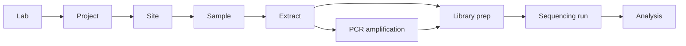

# Workflow

SampleTown's data model walks the wet-lab pipeline from field collection
to sequence analysis. Every entity belongs to a **lab**, which owns a
set of **projects**, which own everything downstream.

The top navbar walks the same chain. Order matters — you can't add a
sample without a site, an extract without a sample, a PCR without an
extract, and so on.

## Project

A project groups everything for a single study, grant, or collection
campaign. PI, institution, contact email, funding lines, and an optional
GitHub repo (separate from the snapshot repo) for project-specific
metadata.

The project detail page shows two tables in workflow order:

1. **Sites** — every sampling location for the project. "Add Site" is
   the first call to action.
2. **Samples** — every collected sample, joined with its site. "Add
   Sample" is dimmed until the project has at least one site (you'd
   need a site_id to attach the sample to).

Plus a **People** roster that aggregates personnel attribution across
every downstream entity (sample collectors, extractors, PCR operators,
etc.).

## Site

A geographic point where samples were collected. Required: latitude +
longitude (click the map to drop a pin), an environment description
(`env_broad_scale` like *marine biome [ENVO:00000447]*, plus
`env_local_scale`), and a free-text site name.

Optional: photo gallery, access notes, locality string. Sites with
coordinates show up as pins on the `/sites` map.

## Sample

A physical unit collected at a site (a Niskin bottle of water, a
sediment core slice, a host tissue swab). The MIxS-required fields
depend on the picked checklist + extension; the form highlights them
in real time.

Notable fields:

- **`samp_name`** — must be unique within the project
- **`collection_date`** — ISO 8601 (YYYY-MM-DD typically)
- **`env_medium`** — what kind of stuff you collected
  (sea water / sediment / sea ice / etc.). Per-sample, not per-site —
  same site can have multiple media collected on the same day.
- **`samp_collect_device`**, **`samp_store_sol`**, **`samp_store_temp`** —
  lab logistics
- **Numeric environmental measurements** — `temp`, `salinity`, `ph`,
  `chlorophyll`, etc. when measured at collection time

The sample form has a **batch entry mode** (`/samples/batch`) that
transposes the form: parameters are rows, samples are columns,
fill-right shortcuts let you enter "the same value across these 12
samples" once. Plus drag-paste from spreadsheets.

## Extract

DNA / RNA / total nucleic acid extracted from a sample. Records
extraction kit, date, concentration measurements, storage location,
and the protocol (`nucl_acid_ext` URL/DOI per MIxS).

Multiple extracts can come from one sample. Extracts feed into PCR
reactions or directly into shotgun library preps.

## PCR

PCRs are organized as **plates** (typically 96-well) rather than
single reactions. A plate has shared conditions (primer set, polymerase,
annealing temp, cycle count, MIxS `pcr_cond` string) and contains many
amplifications, each pointing back at its source extract and recording
its own well position + QC results.

Single-reaction PCRs (no plate) are also supported for one-off work.

## Library prep

A library prep wraps a PCR product *or* an extract (shotgun) into a
form ready for the sequencer. Library plates work like PCR plates;
single library preps are also fine.

Records the prep kit, indexes (i7/i5 or barcode), platform target
(`ILLUMINA`/`OXFORD_NANOPORE`/`PACBIO`/`ION_TORRENT`), fragment size,
and final concentration.

## Sequencing run

A run pairs an instrument + flow cell + many libraries (the
`run_libraries` junction). For each library on the run we record the
read count and FASTQ paths (`fastq_r1` + `fastq_r2` for paired-end,
`fastq_single` for ONT/single).

## Analysis

A row tracking a downstream pipeline run on a sequencing run — pipeline
name + version + Nextflow session id, status (pending / running /
completed / failed / cancelled), input + output directories, results
JSON. SampleTown doesn't run the pipeline; it tracks *what* was run
and the result location.
